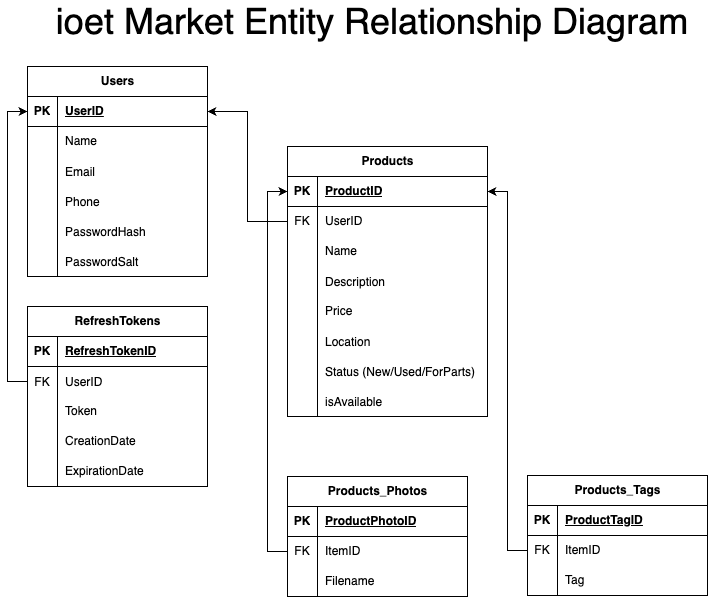

# Backend Course

## Entity Relationship Diagram

After understanding the business rules, one of the next steps for the design of a backend application is the design of the data structure that will contain the persistent information of the system. In this case it has been decided to use a relational database. You can see the Entity Relationship Diagram below.



## App structure

```Txt
📦backend
 ┣ 📂adapters
 ┃ ┗ 📂tests
 ┣ 📂api
 ┃ ┣ 📂src
 ┃ ┃ ┣ 📂dtos
 ┃ ┃ ┗ 📂routes
 ┃ ┗ 📂tests
 ┣ 📂app
 ┃ ┗ 📂src
 ┣ 📂docs
 ┣ 📂factories
 ┃ ┣ 📂config
 ┃ ┣ 📂repositories
 ┃ ┗ 📂use_cases
 ┗ 📂infrastructure
   ┣ 📂docker
   ┗ 📂postgres-data
```

## Branch Naming strategy

You must base your new branch with the main branch. The new branch should start with 'backend/' followed by your name, and finally a '-' (dash) adn the feature tat you worked on.
```
backend/MyName-the-new-feature
```
Example:
```
backend/JuanPerez-product-create-endpoint
```

## How to Start
### Requirements
* Python 3.10.12 or newer
* Docker

### Environment variables
You must create a .env file, you can use the file .env.example as a reference to do that.

Then replace the values inside brackets ({} and the brackets) with the conection parameters for the Docker PostgreSQL database.

By default the following values are defined in the docker compose file.
```
user: root
password: toor
database: ioet_catalog_db
```

### First steps

This project contains several make scripts located inside of the Makefile.

To initialize your environment you can run one of the following commands:

In case of using Mac or Linux:
```
make create_dev_env
```

In case of using Mac or Linux:
```
make win_create_dev_env
```

The next step is to create the docker instance for the PostgreSQL database.
```
make build
```

You must use the following two commands every time you run the code.

First you start the docker instance.
```
make up
```

And then use the following command to start the python code.

If you use mac or linux
```
make start
```

If you use windows
```
make win_start
```

Once the app ir running you can access the the self documented API endpoint in the next URL: http://localhost:8000/docs/


## Challenge Tasks

### For every task detailed here a new PR should be created.

### 1 Create a CI for checking linter issues and run tests.

#### Description
This CI should run every time a New Pull Request is created.

### 2 Create an endpoint to delete a product

#### Description

It is necessary to implement an entry point to delete the information of a previously existing product.

For this implementation, a route must be created inside products_routes.py and this route will use its use case and its request and response methods (inside the file requests and responses, respectively).

The attributes that will have a product are defined in the ER Diagram

#### Acceptance criteria

A product that previously exists should be removed from the database.

### 3 Create an endpoint to edit a product

#### Description

It is necessary to implement an entry point to change the information of a previously existing product.

For this implementation, a route must be created inside products_routes.py and this route will use its use case and its request and response methods (inside the file requests and responses, respectively).

The attributes that will have a product are defined in the ER Diagram

#### Acceptance criteria

A product should be saved in the database and the following attributes can be changed:

- UserID
- Name
- Description
- Price
- Location
- Status
- isAvailable

### 4 Create an endpoint to filter a product

#### Description

It is necessary to implement an entry point to filter products by the following status:

- New
- Used
- For parts

For this implementation, a route must be created inside products_routes.py and this route will use its use case and its request and response methods (inside the file requests and responses, respectively).

The products will be filtered by the “status” attribute defined in the ERD.

#### Acceptance criteria

The endpoint retrieves all the products that match a specific status.

### 5 Add tests for the product routes

#### Description

Add test for the enpoints created in the products_routes.py file.

### 6 Add tests for the product use_cases

#### Description

Add test for the product use_cases created in the app/src/usecases/product/"method" folder.

### 7 Add tests for the SQLProductRepository class.

#### Description

Add test for the SQLProductRepository class located in adapters/src/repositories/sql/tables path

### 8 Deploy the project

#### Description

Deploy the project using AWS. Add a CD to automate this process.
